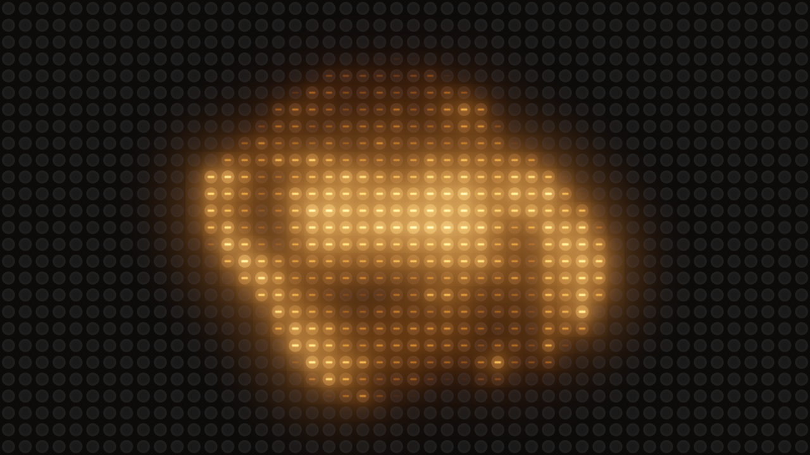

# filament

> **AI-assisted project.** This codebase was created with [Claude](https://claude.com/claude-code)
> (Anthropic), directed and reviewed by a human author. The filaments are not asserted
> but measured: an offline harness drives the real plugin class in a headless GL context
> on a synthetic clock, reads each bulb's temperature back through the plugin's own probe
> hooks, and sets it against the stated heat-balance equation integrated independently in
> double — a filament at a steady voltage settles where power in balances power out, and
> at rated voltage at 2800 K to within 0.06 K; the light at each temperature sits on the
> Planckian locus this harness integrates from the CIE 1931 observer to 1e-6 in xy, and
> moves redward with every step down; a cold start follows the equation to 0.004 K and
> reaches 90% in 65 ms where a lamp without tungsten's fifteenfold inrush would take
> 135; switch-off follows T⁴ radiation plus conduction, not an exponential; a
> triac-dimmed filament ripples at exactly twice the mains, seven times more on a 25 W
> lamp than a 500 W one; and a resize mid-fade keeps every temperature exactly — with six
> negative controls that prove each check can fail. It has **never been loaded into
> Resolume**; it is loaded by [oxbow](https://github.com/stoatworks-labs/oxbow), which is
> a real FFGL host and is not Resolume. See [Status](#status).

The picture on a wall of incandescent bulbs, as an FFGL effect for
[Resolume](https://resolume.com) Arena and Avenue.



<sub>One frame, rendered by `fitest --pipe`, the offline harness — not captured from
Resolume. Resolume's bundled demo clip Metalive 01 at the defaults.</sub>

## The one idea

An incandescent bulb is a tungsten wire heated by current. It is not an LED with a slow
fade. Its light comes from its **temperature**, and its temperature follows the wire's
heat balance: electrical power in, through a resistance that changes with temperature;
radiated power out, as T⁴; conducted power out; all against the wire's heat capacity.

So each bulb of the wall has its dimmer set by its cell of the clip, and its own
filament does the rest.

## What falls out

None of these is drawn. Each is the filament doing what filaments do:

- **Warm fades.** Dim a bulb and it doesn't just get darker, it gets redder: its light is
  Planck's law at the filament's temperature, integrated against the CIE colour-matching
  functions. A 60 W bulb is 2816 K at full and 1975 K at 45%, and its colour follows.
- **A fast rise and a slow fall.** Heating is driven by the power in; cooling by radiation,
  which falls as T⁴, so a cooling wire slows as it goes. A flash comes up in tens of
  milliseconds and dies away in hundreds, and a moving picture smears into a warm trail.
- **Inrush.** Cold tungsten has a fifteenth of its hot resistance, so a cold bulb draws
  fifteen times its rated power and heats twice as fast as its steady time constant says.
- **Mains ripple.** The drive is the mains waveform through a dimmer — a sine-wave
  dimmer, a square-law one, or a leading-edge triac that chops each half-cycle — so every
  filament's temperature ripples at twice the mains. A small filament ripples a lot, a big
  one hardly at all.
- **Big lamps are slow.** Each lamp's wire is sized from its wattage and voltage, so its
  heat capacity is too: a 1000 W lamp lags, a 10 W one snaps, and a 120 V lamp is
  sluggier than a 230 V lamp of the same wattage.

### The honest limit

The equation is the physics, but three of its numbers are assumptions: the wire's
emissivity (0.30), how much of a coiled coil's surface radiates (half), and how much of
the power leaves by conduction (15%). Together they set how heavy each wire is, and so
every time constant; they give a 60 W 230 V filament of 34 µm by 0.92 m, which is the
right size, but no real lamp has been measured against the model. The filament's colour
is a black body's; real tungsten is a little bluer. The shapes of the bulbs, the halo,
the bloom, the glass and the gels are drawn by eye. And thin, dim features in the clip
vanish, because each bulb sees the average of its whole cell.

## Controls

| Group | |
| --- | --- |
| **Wall** | Columns (4–160), Rows (2–90), Gap, Pixel Mode, Glass (Clear, Frosted, Amber, Red, Green, Blue), Gels (Off, RGB: three filaments per cell behind red, green and blue gels). |
| **Bulb** | Wattage (10–1000 W), Dimmer (Linear, Square Law, Triac), Mains (50 Hz / 230 V, 60 Hz / 120 V), Ambient Temp (0–200 °C). |
| **Look** | Glow (the halo from the glass and reflector), Bloom, Exposure (±4 stops), Mix. |

The defaults are a 48 × 27 wall of clear 40 W bulbs on 50 Hz square-law dimmers, with a
modest halo and bloom. Square law because tungsten on a plain voltage dimmer is so
contrasty that every mid-grey goes dark; that is what theatre dimmer curves are for.

The light is what a camera's open shutter would collect over the frame, so the 100 Hz
ripple of a 40 W bulb is invisible at 60 fps; a 10 W bulb on a triac keeps a faint 20 Hz
beat, as a small tungsten lamp filmed at 60 fps does. The output is opaque at Mix 1: the
wall paints the whole frame, whatever the clip's alpha.

## Status

**v0.1.0, unreleased, and honestly early — 25 September 2026.**

### Measured offline, on macOS

`tools/verify.sh` passes on this machine (M4 Max, macOS 26.4) against a fresh universal
Release build, running every check at 320×180 and 1280×720 and again on Apple's software
renderer, which is what a GPU-less CI runner has. What it establishes:

- **Steady state.** A 200 W filament at 1.0, 0.7 and 0.4 of its voltage settles at
  2799.95, 2404.28 and 1862.32 K, against a power balance of 2800.00, 2404.32 and
  1862.40 K.
- **Colour.** At five temperatures from 1975 to 2816 K the light's chromaticity is on the
  Planckian locus to 1e-6, its luminance right to 1e-4, and McCamy's CCT of it agrees with
  McCamy's CCT of the true locus to 0.04 K; each dimming step is redder.
- **Rise.** From cold, the rise follows the equation to 0.004 K; 90% in 65.2 ms, where a
  constant-resistance lamp would take 135.3 ms.
- **Fall.** Switched off, the decay follows radiation plus conduction to 0.17 K, reaches
  1500 K in 176 ms, and slows as it goes: its time constant at 1200 K is 2.5 times its
  time constant at 2400 K. An exponential's would not change.
- **Ripple.** Under a triac the temperature ripples at exactly 100 Hz on 50 Hz mains and
  120 Hz on 60 Hz, 137 K peak to peak on a 25 W filament and 19 K on a 500 W one.
- **Resize.** An output resize and a change of grid, mid-fade, leave every bulb's
  temperature exactly where it would have been.
- **Negative controls.** A lamp without inrush fails the rise; a linear cooler fails the
  fall; DC fails the ripple; a lamp without conduction fails the steady state; a colour
  table read 5% hot fails the colour; a resize that restarts the wall cold fails the resize.
- **No dead controls**: all 14 change the picture.
- **The bundle** is universal, and oxbow sees `SW Filament`, `FI01`, an effect, and renders
  120 frames through it.

Render cost, `fitest --bench` (best of three, `glFinish` both sides, a shared GPU):

| | default (48 × 27, 40 W) | largest grid (160 × 90, 40 W) | largest, 10 W on RGB gels (worst) |
| --- | --- | --- | --- |
| 1280×720 | 0.25 ms (1.5%) | 0.30 ms | 1.54 ms |
| 1920×1080 | 0.26 ms (1.5%) | 0.38 ms | 1.63 ms |
| 3840×2160 | 0.39 ms (2.3%) | 0.54 ms | 1.78 ms (10.7%) |

(percentages of a 60 fps frame). The equation is solved in 34 to 147 substeps a frame,
depending on the lamp; small lamps need the most.

### Not done

- **Never loaded into Resolume**, and never built on Windows.
- Seen only on Resolume's bundled demo clips, never on camera footage.
- No user guide, no OpenFX port, no factory presets.

## Browser demo

[filament-demo.stoatworks-labs.com](https://filament-demo.stoatworks-labs.com/)
runs the plugin's own shaders in WebGL2 — the drive, thermal, bloom and output
passes and the filament library they share — spliced in from `source/Shaders.cpp`
by `demo/tools/sync_shaders.py` and checked character for character, with the
lamp's tables and the Planck table, by `demo/tools/check_shaders.py` from
`tools/verify.sh`. So the heat balance runs on the GPU as in the plugin: RK4
substeps over a float temperature per bulb, ping-ponged. Its CPU half — the clock
and the mains phase, the lamp's wire sized from its wattage, the substep rule and
every control's law — is a **hand port to JavaScript**, and nothing checks a port
but a reader; the emissivity, the radiating fraction and the conducted share are
the plugin's assumptions there as here. Columns and Rows are dropdowns (the kit
has no integer control). It is served from `demo/` by this repo's own Worker and
redeploys on every push to main.

## Build

Needs CMake 3.15+, a C++17 compiler and the FFGL SDK submodule.

```sh
git clone --recurse-submodules https://github.com/stoatworks-labs/filament
cd filament
cmake -B build -DCMAKE_BUILD_TYPE=Release
cmake --build build --parallel
```

The macOS bundle is universal (Apple Silicon and Intel). `cmake --install build` copies
it into `~/Documents/Resolume Arena/Extra Effects`; for Avenue, pass
`--prefix "$HOME/Documents/Resolume Avenue/Extra Effects"`.

## Building and testing

```sh
tools/verify.sh                                   # everything, ~4 minutes
./build/fitest --list                             # the parameters
./build/fitest --rise --size 320x180              # one check
./build/fitest --negative                         # every check can fail
python3 tools/sweep.py                            # no dead controls
python3 tools/planck_table.py --check             # the colour table recomputes
ffmpeg -i clip.mov -f rawvideo -pix_fmt rgba - | ./build/fitest --pipe --size 1280x720 --fps 30 | ffplay -f rawvideo -pixel_format rgba -video_size 1280x720 -
```

`CLAUDE.md` is the command reference and `AGENTS.md` the reasoning: the lamp model, the
traps, and where every tolerance comes from.

## License

MIT — see [LICENSE](LICENSE). The CIE 1931 colour-matching functions, the tungsten
resistivity table and the heat-capacity fit are published data; their sources are in
[ATTRIBUTIONS.md](ATTRIBUTIONS.md).

<!-- attributions:start -->
This project is built on other people's work — see [ATTRIBUTIONS.md](ATTRIBUTIONS.md).
<!-- attributions:end -->
